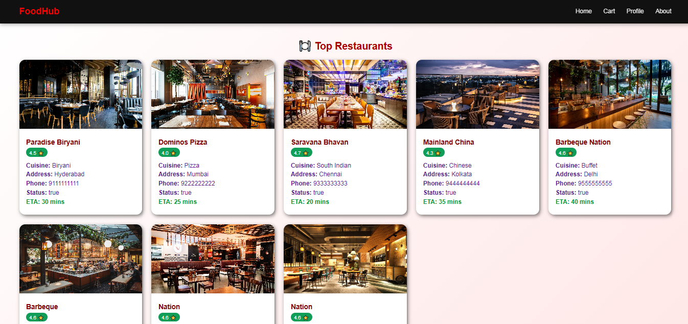
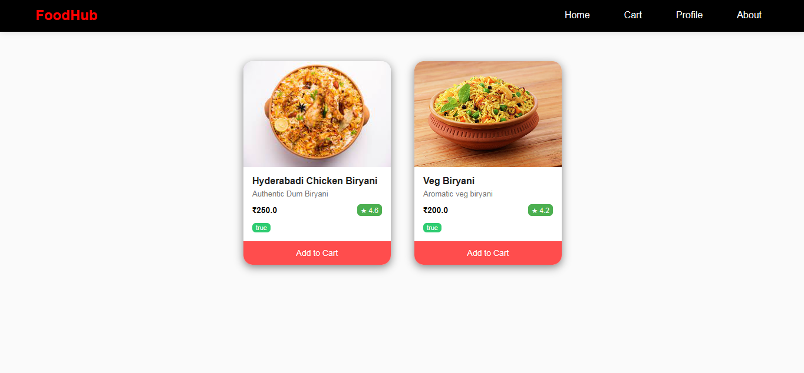
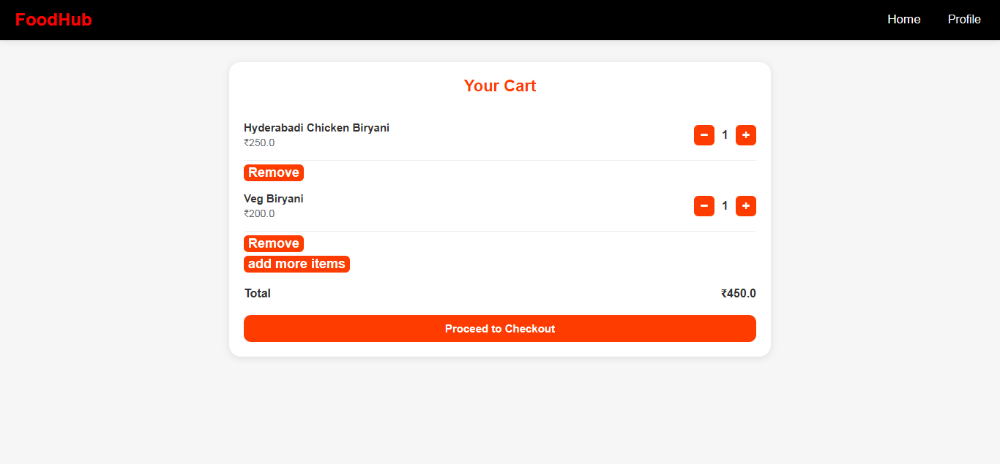
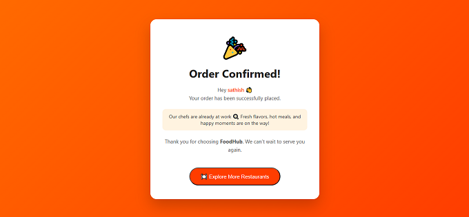

# FoodHub 🍔🍕

FoodHub is a Java-based web application developed using **Servlets and JSP**.
It allows users to explore restaurants, add food items to a cart, and place orders seamlessly.

## 🚀 Features
- User authentication
- Restaurant and menu browsing
- Cart management using sessions
- Order placement and confirmation

## 🛠 Tech Stack
- Java
- Servlets
- JSP
- JDBC
- MySQL
- HTML, CSS

## 📦 Project Structure
- `src/main/java` – Java source code (Servlets, DAO, POJO)
- `src/main/webapp` – JSP pages, CSS, images

## 📸 Application Screenshots

### 🏬 Restaurant Listing Page

### 📖 Menu Page

### 🛒 Cart Page

### ✅ Order Success Page

